# Multi Tentant

Este é um projeto para teste e exemplificação de como criar uma aplicação *multi-tentant* usando base de dados **POSTGRES** e que o isolamento de dados se dá por esquemas.

## Definições

### O que é uma aplicação multi-tenant

Uma aplicação multi-tentant é um sistema que suporta múltiplos clientes ou usuários em diferentes locais ou organizações. Cada cliente ou usuário é conhecido como um *"tenant"* na terminologia da aplicação *multi-tentant*.

### Vantagens de uma aplicação multi-tenant

Essa abordagem de design permite que a aplicação seja escalada de forma independente para cada tenant, permitindo que cada um tenha sua própria instância da aplicação, mas compartilhe a mesma infraestrutura subjacente. Isso é particularmente útil quando você tem clientes diferentes com requisitos diferentes, mas deseja evitar a duplicação de código ou a criação de instâncias separadas da aplicação para cada cliente.

### Princípios

O desenvolvimento da aplicação *"multi-tenant"* segue os seguintes princípios:

1. **Separação de dados:** Cada tenant tem seus próprios dados, que são isolados dos dados de outros tenants. Isso é feito para garantir a privacidade e a segurança dos dados.

1. **Segregação de recursos:** Os recursos da aplicação, como memória, CPU e disco, são compartilhados entre os tenants, mas cada tenant tem seu próprio espaço de nome e suas próprias permissões de acesso.

1. **Escalabilidade:** A aplicação pode ser escalada de forma independente para cada tenant, permitindo que cada um tenha sua própria capacidade de processamento e armazenamento.

1. **Flexibilidade:** Os tenants podem personalizar a aparência e o comportamento da aplicação de acordo com suas necessidades específicas.

## Proposta

Por se tratar de uma aplicação teste, o projeto se basea em uma API Rest é utilizada para a que entrega de dados onde todos os clientes possuem a mesma estrutura de dados mas é necessario garantir o isolamento de dados entre eles. O projeto se baseia no [ASP.NET Core](https://docs.microsoft.com/pt-br/aspnet/core/), [EF Core](https://docs.microsoft.com/pt-br/ef/core/) e [Npgsql](https://www.npgsql.org/).

## Implementação

Para a implementação o projeto terá dois contexto de banco, Core e Business. O contexto Core terá as informações de dados dos clientes, para este exemplo o Core terá apenas duas entidades Tenant e User. Mas pode haver quantas entidades forem necessárias para atender o projeto.

Na entidade Tenant, é composta por identificador,nome e esquema. Já a entidade User, será composta por identificador, nome, email, username, senha e o identificador do tenant.

Com isto, definimos uma premissa. O username deve ser único para toda a aplicação, mesmo em clientes o username não poderá se repetir. Estou sendo redundade sobre o username pois este é uma peça importante no funcionamento da aplicação.

O contexto Business irá ter todas as entidades que a aplicação suporta e é necessário para o seu devido funcionanmento.

### Funcionamento

Para a utilização dos contextos de banco iremos obte-los atraves de injeção de dependência. Mas para isto requer alguns pontos de atenção.

Para o Contexto Core, não existe nenhum segredo. A inclusão do mesmo segue padrão.

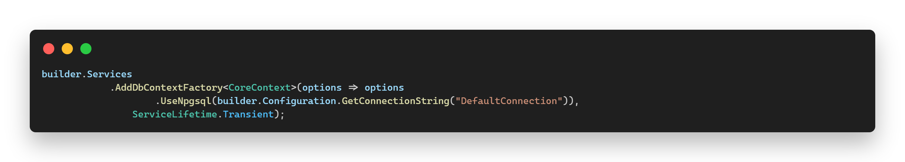

Para o contexto Business precisamos incluir uma entrada de informação que é o esquema, o qual irá garantir que o contexto irá acessar apenas o esquema informado. Para esta implementação estamos criando um interface que também irá ser utilizada na migration.

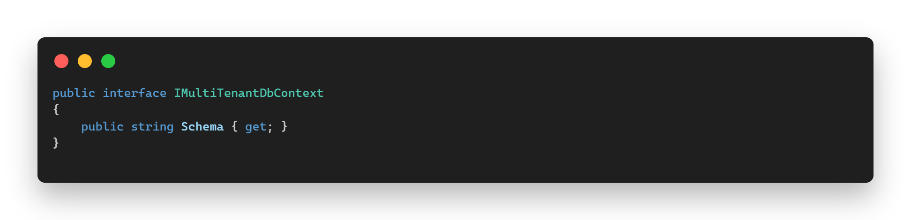

Para o contexto em si, irá extender a interface e o DbContext. A classe deve conter dois construtores. Um a ser utilizado para o migration e o outro a ser utilizado de forma padrão pela aplicação.

* Contrutor para o contexto de migration:
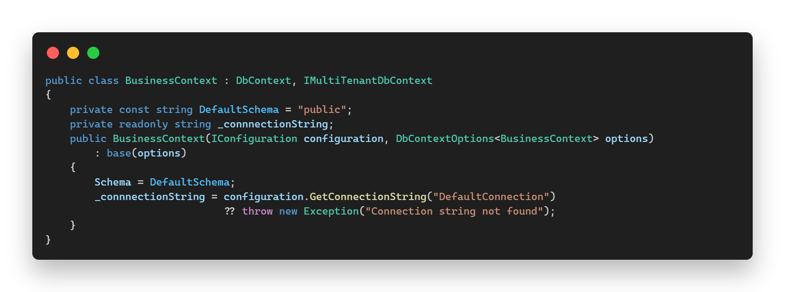

* Construtor para o contexto de aplicação:
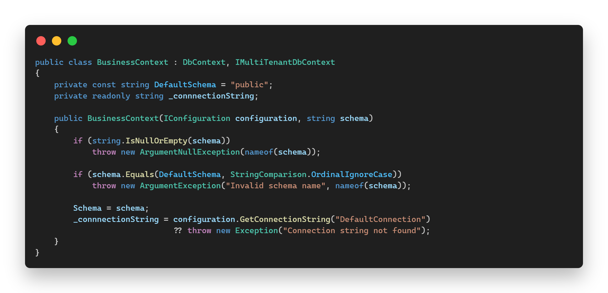

Com isto, efetua uma sobre escrita no *OnModelCreating* do DbContext e define o esquema informado e no *OnConfiguring* carrega as informações de conexão. Esta sendo carergado e utilizada a string de conexão no *OnConfiguring* para que possa ser definido que cada esquema terá o seu próprio controle de versão do **migration**. No caso do contexto para o migration o schema informado será o *"public"*. Para o migration deverá ocorrer alterações que será sendo especificado mais abaixo.

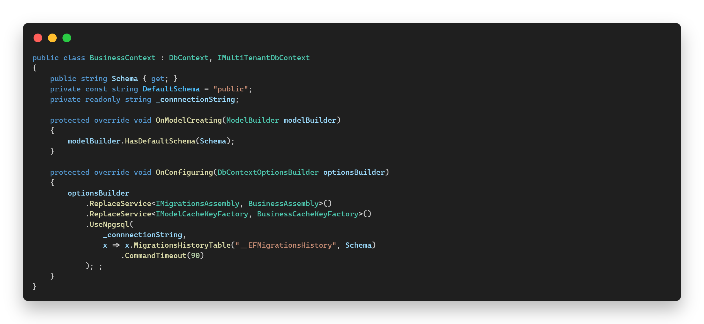

 Antes de falr sobre o DI do contexto, primeiro falar sobre a autenticação na API. Para o consumo dos métodos expostos na API é indispensável a autenticação do usuário, o projeto irá utilizar o [JWT](https://jwt.io/) para isso. Ao se autenticar com sucesso será gerado um token composto por *"claims"*, que contém as informações do usuário. Um destes *"claim"* deve conter referencia ao username.

Tendo a autenticação implementada e todos os demais métodos expostos requendo o token bearer gerado, criamos um procedimento para a injeção de dependência do contexto Business. Neste procedimento iremos considerar duas ações que irão requerer o DI do Business.

1. **Migration:** Como para gerar o migration não existirá nenhum usuário logado, o procedimento de injeção de dependência deve considerar um esquema padrão. Mas também deve haver mecanismos para que a aplicação valide este acesso.

1. **Execução da API:**  Colocando de forma simples, uma esquema padrão para o migration é aceitavel mas para a utilização da API deve ser considerado um erro.

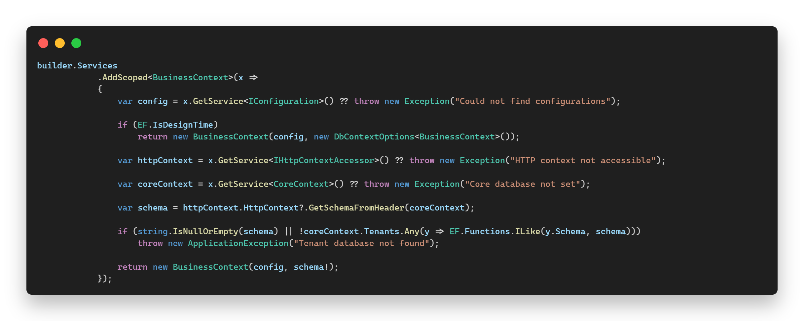

O contexto é injetado como scope, para maiores informações sobre injeção de dependência veja a [documentação ASP.NET](https://learn.microsoft.com/en-us/aspnet/core/fundamentals/dependency-injection?view=aspnetcore-8.0). Para este DI validamos se uma execução de ***Design Time*** com o comando:

> EF.IsDesignTime

Descrevendo de uma forma simplificada, este comando identifica se é uma DI requisitado na execução de migration. E neste caso é utilizado o primeiro construtor onde não é informado o esquema e é definido como o esquema padrão *"public"*.

Caso seja um DI requsitado pela própria API, será extraido o username do *HttpContext* e consultado no Core a qual tenant o username esta vinculado e então carregado o Business contexto especificando o esquema do cliente. Este instrução pode ser vista no método **GetSchemaFromHeader**.

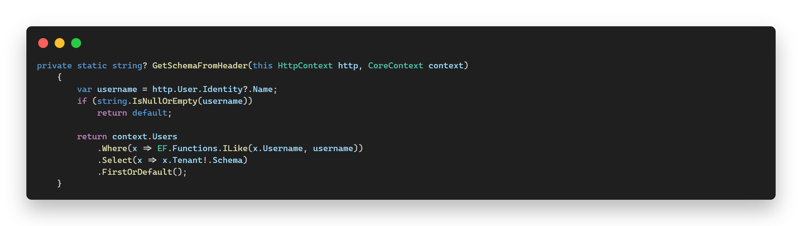

#### NOTA:

Para o uso do BusinessContext atraves de DI junto a API é essencial que o usuário esteja logado e tenha informado o *BEARER TOKEN* na autenticação do header da requisição.

## Migration

Ao gerar o migration do BusinessContext o mesmo irá definir que o schema deste esquema será o *"public"*. Mas o arquivo gerado pelo migration deve ser alterado para que o mesmo consiga entender os diferentes clientes da aplicação e que os migrations possar ser executados atraves de comando ou inicialização da propria aplicação.

O arquivo gerado deve ser incluso no construtor a interface criado para a informação de esquema e então ser utilizado o mesmo para especificar o esquema do cliente.

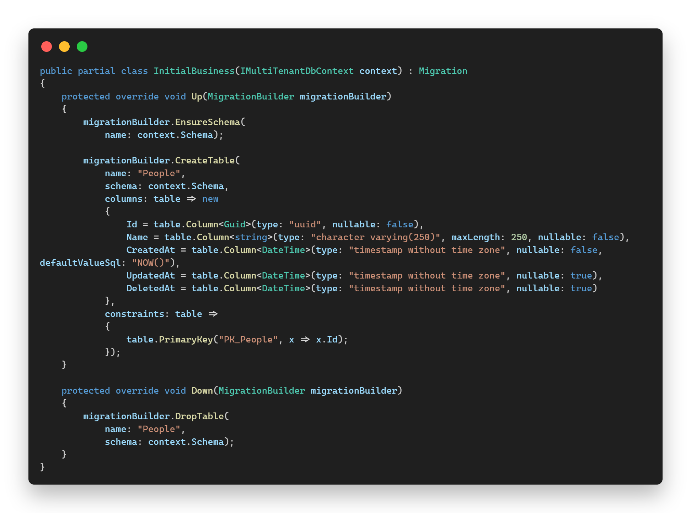

Para executar o migration dinamicamente, deve ser feito a implementação das interfaces *IMigrationsAssembly* e *IModelCacheKeyFactory*, ambas as interfaces fazem parte do pacote do EF.

* Implementação do *IMigrationsAssembly*
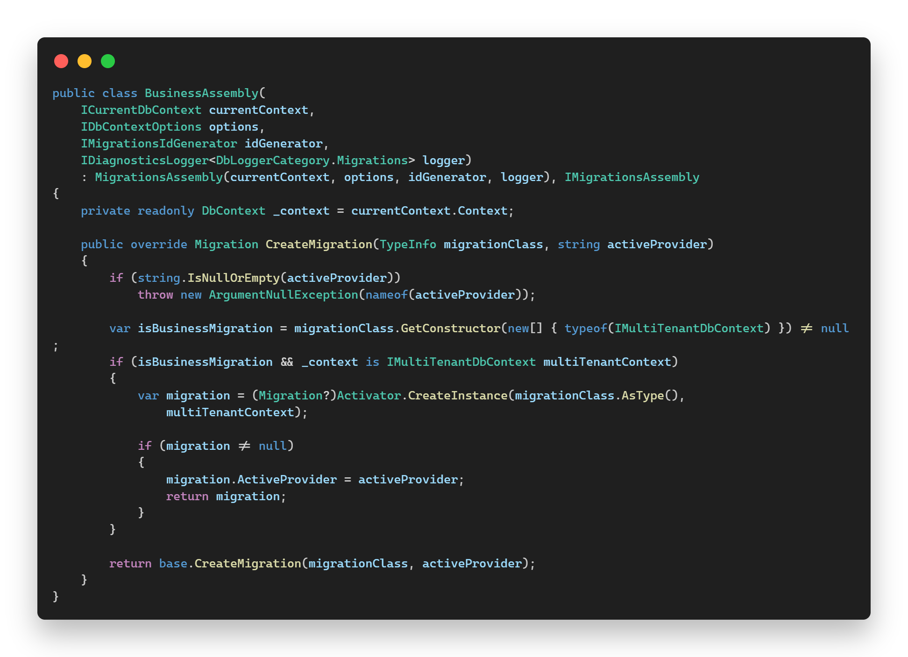

* Implementação do *IModelCacheKeyFactory*
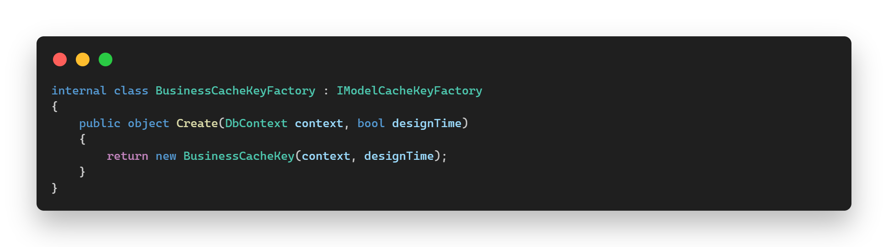

* Implementação do *CacheKey*
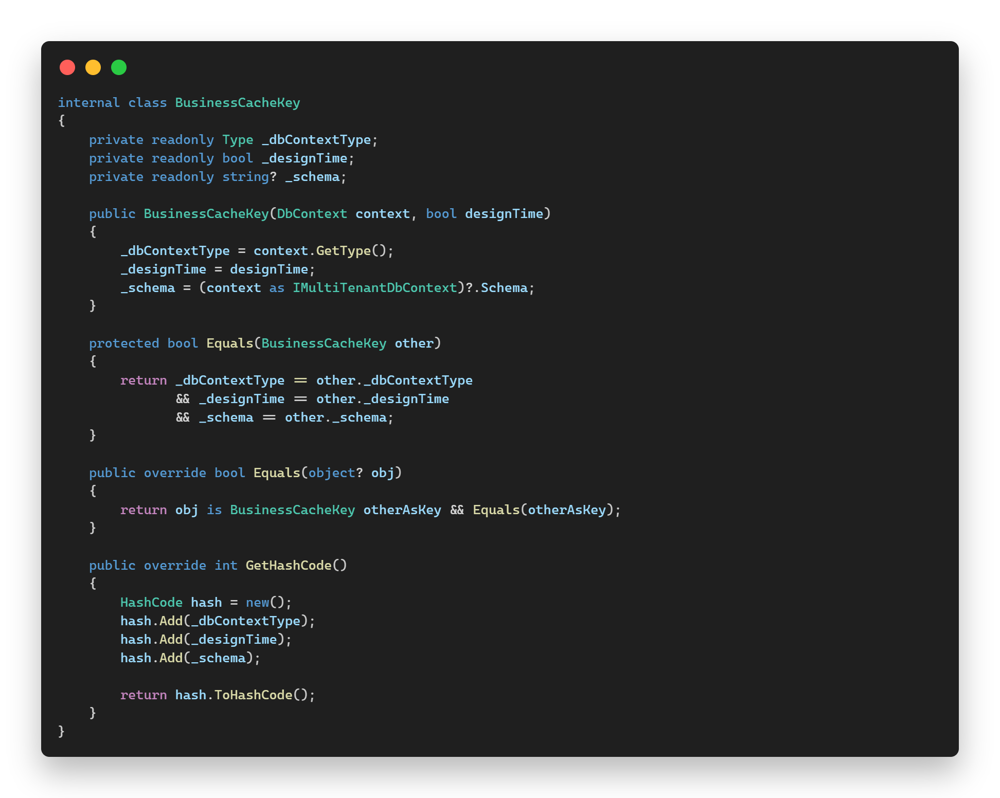

Tendo a implementação feita basta efetuar o replace destes serviços dentro do *OnConfiguring* do BusinessContext com o comand:
> optionsBuilder.ReplaceService<IMigrationsAssembly, BusinessAssembly>();
> optionsBuilder.ReplaceService<IModelCacheKeyFactory, BusinessCacheKeyFactory>();

Com estas alterações feitas é possivel efetuar o migration atraves de comando dentro da propria aplicação. Como no exemplo abaixo:

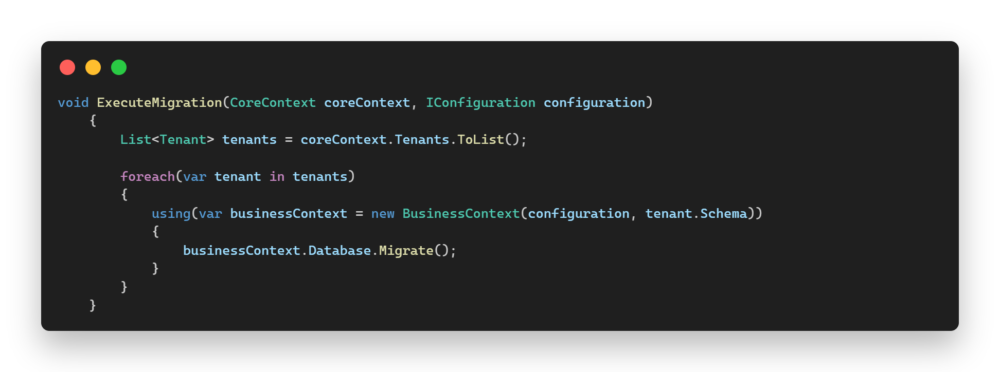

## Conclusão

Com as alterações aqui demonstradas torna a utilização do C# com o EF Core uma ferramenta versatil para o desenvolvimento de aplicações multi-tenants com o nivel de isolamento de dados por meio de esquemas plausivel.

Contudo, é importante deixar registrado que está não é uma solução oficial Microsoft ou mesmo provida/suportada pelo EF.
